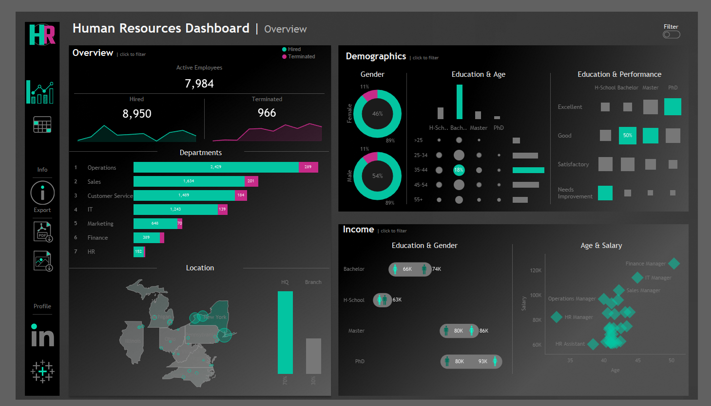
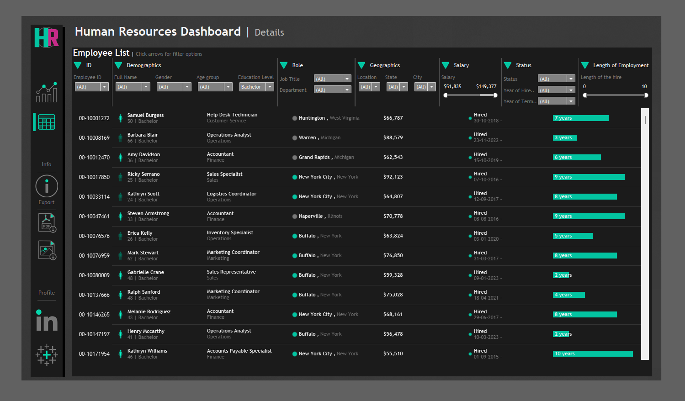

# 👥 Human Resources Dashboard | Workforce Analytics

**Human Resources Dashboard** provides powerful insights into employee demographics, departmental trends, compensation analysis, and individual employment data. Built for HR teams and leadership, it enables data-driven decision-making across the employee lifecycle.

View it here(https://public.tableau.com/app/profile/shivaramakrishnan.rajendran/viz/HRDashboard_17404511612260/HROverview)

---

## 📊 Dashboard Overview

### 🔹 Active Workforce Snapshot
- **Active Employees**: 7,984  
- **Hired**: 8,950  
- **Terminated**: 966  

### 🔹 Departmental Analysis
- Compare hiring vs terminations across departments like Operations, Sales, Customer Service, IT, Marketing, Finance, and HR.

### 🔹 Demographic Insights
- Gender distribution  
- Education level by age group  
- Education level vs performance  

### 🔹 Income Insights
- Salary breakdown by **education** and **gender**  
- Scatter plot of **age vs salary**, highlighting key roles (e.g., Finance Manager, IT Manager)

### 🔹 Geographic Distribution
- Map view of employee concentration by state  
- HQ vs branch workforce split

---

## 📋 Employee Details View

An interactive, filterable employee directory with key information such as:

- **Employee ID, Name, Gender, Age Group, Education**
- **Job Title, Department, Salary, Location**
- **Status (Hired/Terminated), Date of Hire**
- **Length of Employment** (in years)

### 🔍 Key Features:
- Dynamic filters for location, department, salary range, and education
- Bar indicators for employment length
- Export functionality for PDF reports

---

## 🖼️ Dashboard Snapshots

### 🔎 Overview Page  

### 📋 Employee Details Page  

---

